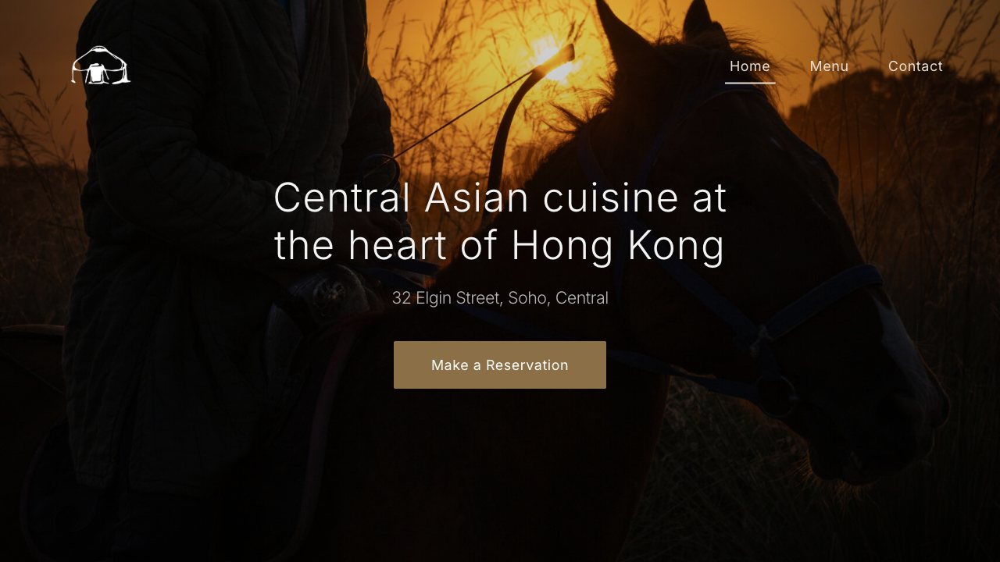

# Restaurant Page (Yurt)
Single-page restaurant site with tabbed sections (home, menu, contact) and a reserve flow.

Demo: [Live site](https://alimkhann.github.io/odin-projects/restaurant-page)
Screenshot:

Tech: JavaScript, HTML, CSS, Webpack.

## Scripts
- `npm run dev` — start the dev server (webpack-dev-server).
- `npm run build` — build production assets to `build/restaurant-page`.
- `npm run deploy` — deploy via git subtree to `gh-pages`.
