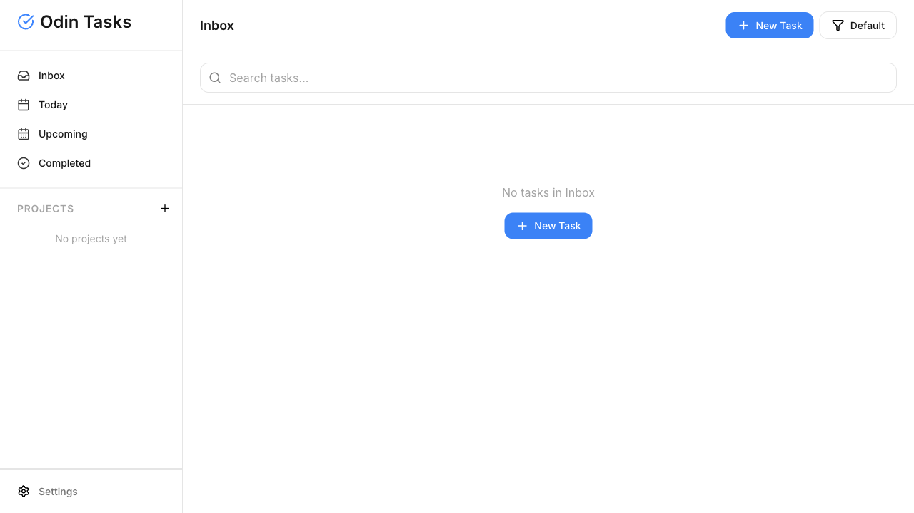

# Odin Tasks (Todo List)
Task manager with projects, smart views (Inbox/Today/Upcoming/Completed), tags, search, drag-and-drop ordering, and localStorage persistence.

Demo: [Live site](https://alimkhann.github.io/odin-projects/todo-list)
Screenshot:

Tech: JavaScript, HTML, CSS, Webpack.

## Scripts
- `npm run dev` — start the dev server (webpack-dev-server).
- `npm run build` — build production assets to `build/todo-list`.
- `npm run deploy` — deploy via git subtree to `gh-pages`.
