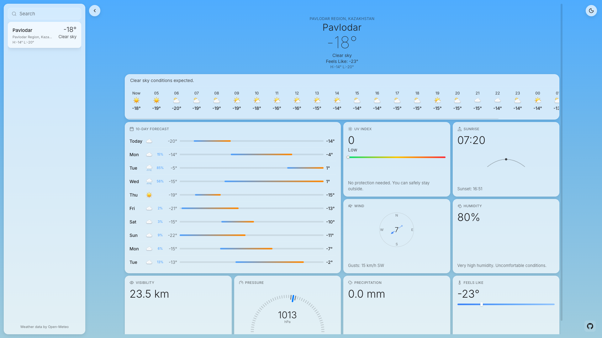
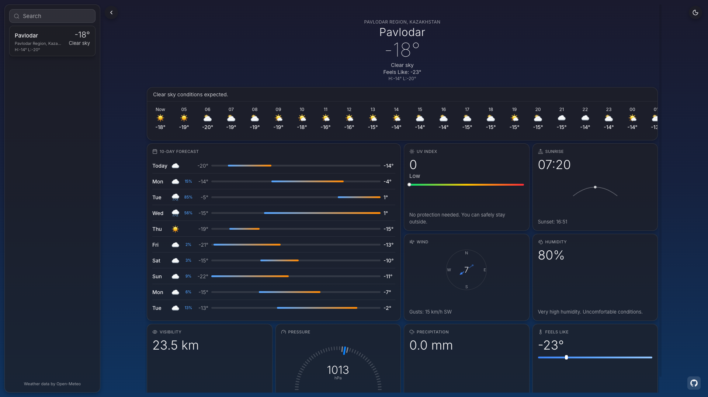
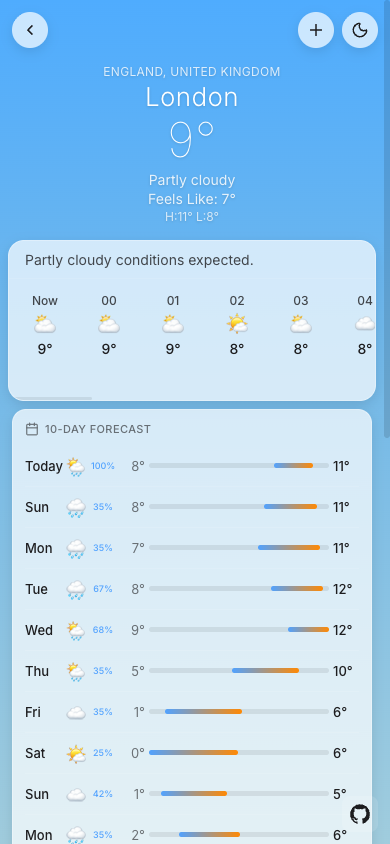
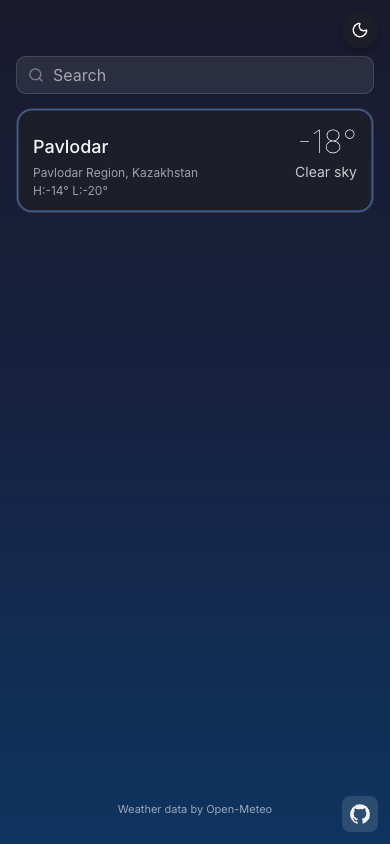

# Weather Appleish
Apple Weather-inspired single-page app with current conditions, 48-hour hourly forecast, 10-day forecast, and expandable weather detail cards.

Demo: [Live site](https://alimkhann.github.io/odin-projects/weather-appleish)

Screenshots:

Tech: TypeScript, Vite, Biome, Chart.js, SortableJS, lucide-static.
Data: Open-Meteo forecast and geocoding APIs (no API key).
Architecture: API -> Mappers -> Services -> Store -> Controllers -> UI with a single reactive app store.
Features: search with autocomplete, saved locations with drag-and-drop ordering, light/dark theme, unit switching, and layered caching.

## Scripts
- `npm run dev` - start the Vite dev server.
- `npm run build` - type-check and build production assets.
- `npm run preview` - preview the production build locally.
- `npm run check` - run Biome checks.
- `npm run check:fix` - run Biome checks and apply fixes.
